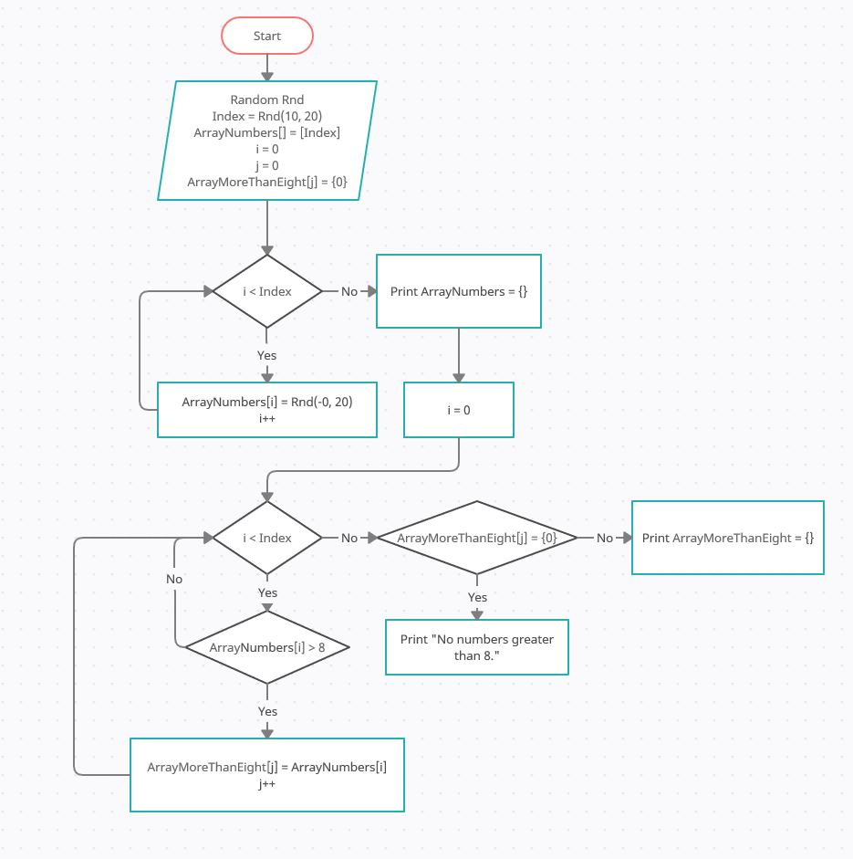

# Итоговая проверочная работа.
## Контрольная работа группа 1818.
#
**Задача:** 

Написать программу, которая из имеющегося массива целых чисел формирует массив из чисел, больших 8. Первоначальный массив можно ввести с клавиатуры, либо сгенерировать случайным образом. При решении не рекомендуется пользоваться коллекциями, лучше обойтись исключительно массивами.

**Решение:**

1. Из случайных чисел задается массив из n элементов от 10 до 20 элементов.
2. Массив заполняется случайными числами в диапазоне от 0 до 20.
3. Значения массива выводятся строкой на экран консоли.
4. При помощи цикла перебираются элементы массива и из чисел больших 8 формируется другой массив.
5. Значения массива из чисел больших 8 строкой выводятся на экран консоли.
#
## Блок- схема. ##

